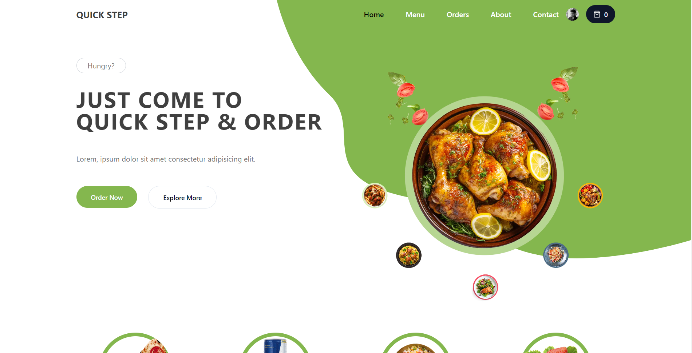
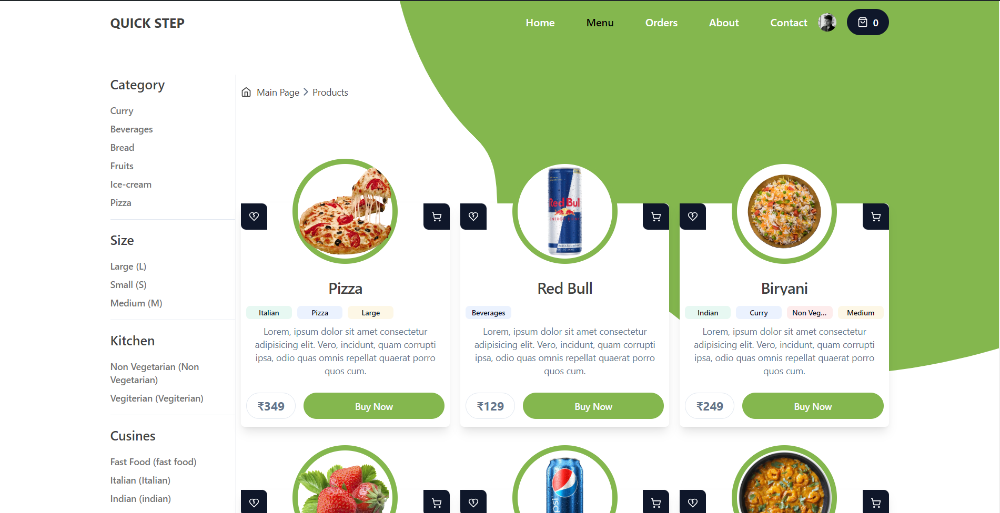
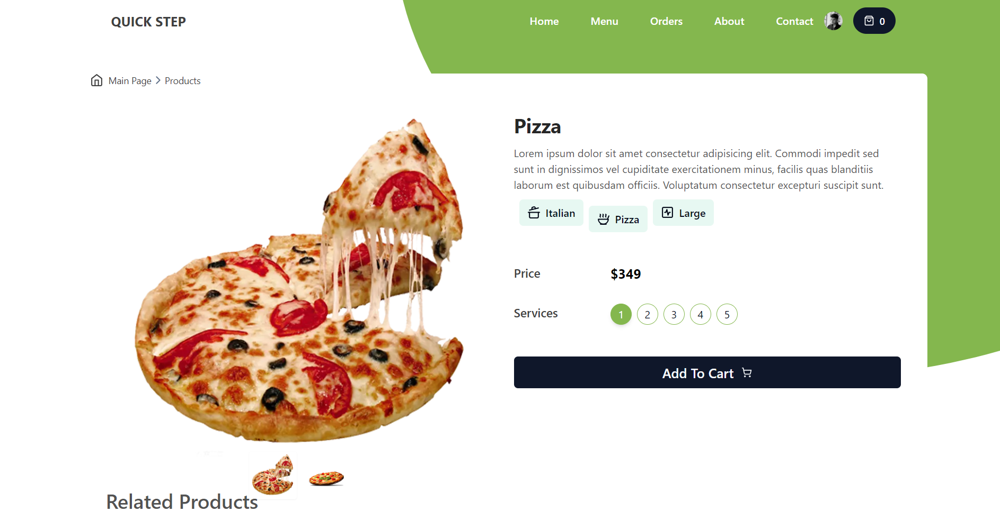
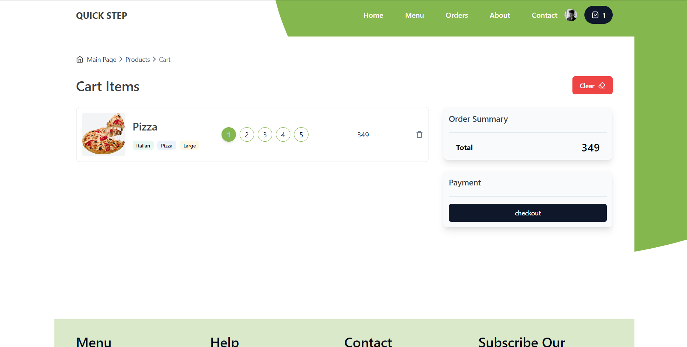
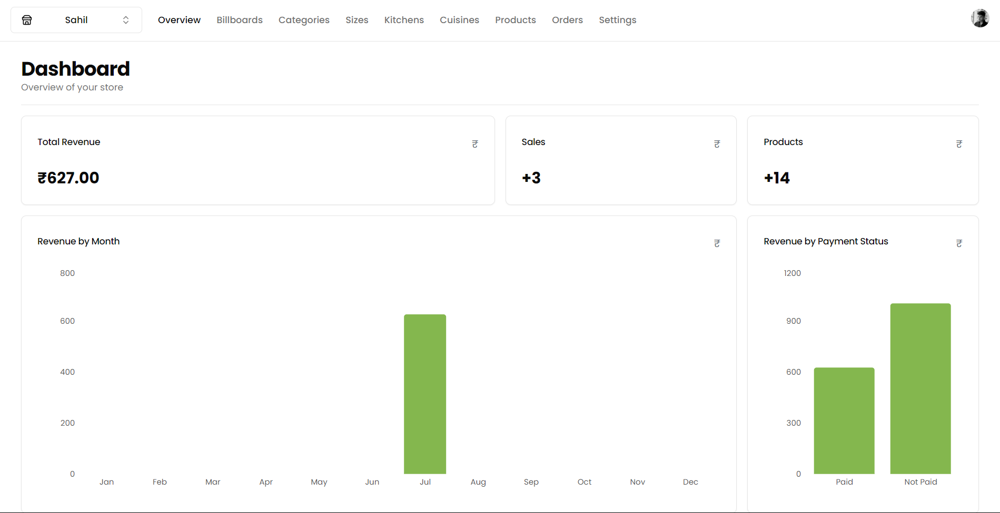
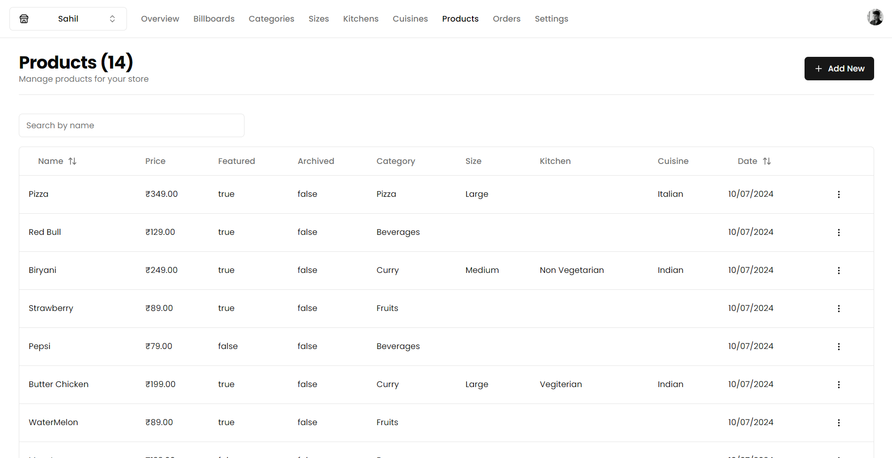
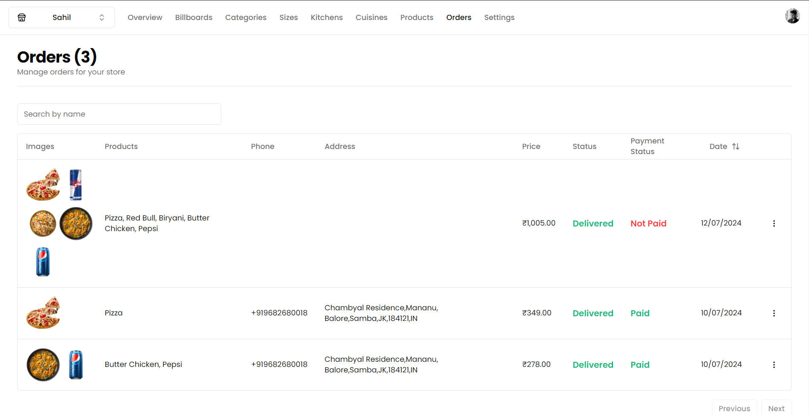

# Food Order Next Firebase TS Project


## Checkout Live at : 
- [Links](#links)
    - [Frontend](#frontend)
    - [Backend](#backend)

## Project Overview

The `food-order-next-firebase-ts` project is a web application designed for ordering food online. It consists of two separate Next.js 14 projects: `customer` and `vendor`. The `vendor` project allows vendors to create, edit, and process orders, while the `customer` project allows customers to browse and purchase food items. Firebase is used for storage and real-time database functionalities.


    

## Dependencies

To get started with this project, you'll need to install the following dependencies:

```bash
npm install @clerk/nextjs       # Authentication
npm install react-hot-toast     # Pop-up Notifications
npm install axios               # REST APIs
npm install zod                 # TypeScript based schema validation
npm install zustand             # React hooks state management
npm install react-hook-form     # React-based forms
npm install firebase            # Firebase for temporary database
```

# Project Overview
## Customer Project
The `customer` project is designed for end-users to browse, search, and order food items. It includes functionalities for user authentication, viewing available items, adding items to the cart, and checking out.

## Vendor Project
The `vendor` project allows food vendors to manage their food items and orders. Vendors can log in to create and edit food items, view incoming orders, and update the status of orders.

## Setting Up Firebase
1. **Create a Firebase Project**: Go to the Firebase Console and create a new project.

2. **Register Your App**: Register both the `customer` and `vendor` applications in your Firebase project.

3. **Install Firebase SDK**: Ensure you have the Firebase SDK installed in both projects.

4. **Configure Firebase**: Add your Firebase configuration to both projects. This includes the Firebase API key, Auth domain, Project ID, etc.

## Running the Projects
To run the projects, navigate to the respective directories (customer or vendor) and use the following commands:

```bash
# Navigate to the customer project
cd customer
npm install
npm run dev

# Navigate to the vendor project
cd vendor
npm install
npm run dev
```

Ensure both projects are running on different ports to avoid conflicts.

# Project Images
## Customer Side





## Vendor Side



